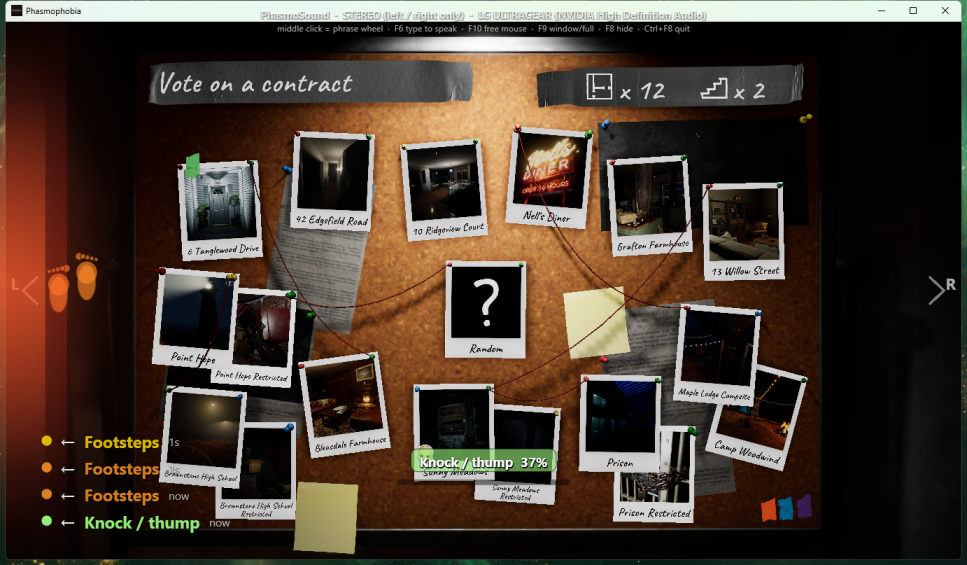
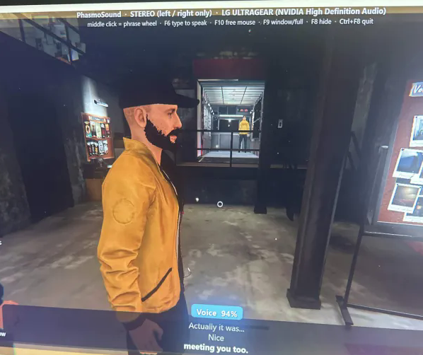

# Phasmophobia Tools for the Deaf and Hard of Hearing

**Play Phasmophobia by sight.** See where every sound comes from, read what your team says, and talk
back to them with your own voice board.

Phasmophobia is a game built almost entirely on listening. Footsteps tell you the ghost is close, a
door slam tells you it is active, the spirit box answers out loud, and your team plans the whole
mission over voice chat. A deaf or hard of hearing player loses nearly all of that. This is an
overlay that puts it on the screen instead.

It runs **next to** the game, never inside it. Nothing is injected, no game file is modified, and no
memory is read. It listens to what your speakers are playing, the same as a screen reader listens to
a web page.

**Version 0.1** — working and in daily use, rough in places. See [Known limits](#known-limits).

---

## What it does

*Every screenshot below is from a real match.*

### 1. See sounds, and where they are


*The ghost is in the room, breathing and gasping. You can see it.*

* **The screen edges glow** where sound is coming from. Left edge means it is louder on your left,
  right edge on your right. With a surround setup, the top edge is in front of you and the bottom
  edge is behind you.
* **A footprint icon** appears on the side when footsteps are heard that are too far off-centre to be
  your own. Your own footsteps sit dead centre in the mix; the ghost's do not.
* **An event log** names each sound with a direction arrow and how long ago it happened: `Footsteps`,
  `Door`, `SLAM`, `KNOCK`, `Breathing`, `WHISPER`, `HEARTBEAT`, `PHONE RINGING`, and more.
* **Your own noise is filtered out.** The overlay watches your keyboard and mouse. Centred footsteps
  while you hold a movement key, and centred door or item sounds right after you press an action key,
  are yours and are hidden. Anything off to one side always shows.



*Footsteps too far to the left to be your own: footprints on that edge.*

### 2. Read what people say



*A teammate saying "nice meeting you too", read off the screen.*

Live captions of everything the game plays, including other players' voice chat, the spirit box, and
the game's own voice lines. Transcribed locally by [Whisper](https://github.com/openai/whisper)
(via [faster-whisper](https://github.com/SYSTRAN/faster-whisper)) on your graphics card. Nothing
leaves your machine.

Windows 11 has a built-in Live Captions feature. It was tried first and it stalls on game voice chat,
often going silent for a whole match. This is the reason the project ships its own captioner.

### 3. Talk to your team


* **Middle-click** opens a phrase wheel. **Scroll** to turn between seven categories, **point and
  click** a line, and it is spoken into the game's microphone in a natural voice.
* 63 ready-made lines covering the whole game: evidence claims (`I have E M F level five here`), ghost
  behaviour (`It slammed a door`), locations, equipment, status, and ghost-type reasoning.
* **F6** opens a text box for anything not on the wheel. Type, press Enter, and it is spoken.
* Voice is [Kokoro-82M](https://huggingface.co/hexgrad/Kokoro-82M) running locally and free. Every
  wheel line is pre-generated, so it plays the instant you click it.
* Optional: generate the wheel lines with [ElevenLabs](https://elevenlabs.io) for a more human voice.
  Their free tier covers the whole list.

### 4. Edit your phrases in a browser

While the overlay runs, open <http://127.0.0.1:8765/>. Edit lines, reorder them, add your own, and
pre-generate the audio. Saved lines are live the next time you open the wheel.

---

## Requirements

| | |
|---|---|
| OS | Windows 10 or 11 |
| Game | Phasmophobia, in **windowed or borderless** mode (exclusive fullscreen hides every overlay) |
| Build | [.NET 10 SDK](https://dotnet.microsoft.com/download) |
| Python | 3.12, installed automatically by the setup script through [uv](https://docs.astral.sh/uv/) |
| GPU | Optional. An NVIDIA card makes captions much faster; without one they fall back to the CPU |
| Virtual mic | [VB-CABLE](https://vb-audio.com/Cable/) — only needed to *speak*; seeing and reading work without it |
| Disk | About 3 GB, mostly the speech models |

Everything runs offline once installed. No account and no API key is required for any feature.

---

## Install

```powershell
git clone https://github.com/devarim28supply-afk/Phasmophobia-Tools-for-the-Deaf-and-Hard-of-Hearing.git
cd Phasmophobia-Tools-for-the-Deaf-and-Hard-of-Hearing
powershell -ExecutionPolicy Bypass -File scripts\setup.ps1
```

The script builds the overlay, creates the Python environment, downloads the sound-classifier and
speech models, and writes a starting `config.json`. It takes about ten minutes, mostly downloads.

Then install VB-CABLE if you want the speaking features, and set the game up:

1. Run `setup\VBCABLE_Setup_x64.exe` **as administrator**, click *Install Driver*, and reboot.
2. In Phasmophobia: **Options → Audio → Microphone = CABLE Output**.
3. Start the game, then run `app\PhasmoSound.exe`.

Full detail, including every audio-routing trap, is in **[docs/INSTALL.md](docs/INSTALL.md)** and
**[docs/AUDIO-ROUTING.md](docs/AUDIO-ROUTING.md)**. The routing document is worth reading even if
everything works; it explains why the game may ignore the microphone you picked in its own menu.

---

## Keys

| Key | Action |
|---|---|
| **Middle mouse** | Open / close the phrase wheel. Scroll to change category, click a line to say it |
| **F6** | Type a line to speak |
| **F5** | Open the phrase wheel from the keyboard |
| **F8** | Hide / show the overlay |
| **F9** | Switch the game between borderless fullscreen and a window |
| **F10** | Free the mouse from the game and move it to another monitor |
| **F7** | Save the last 2.5 s of audio as an unlabelled clip |
| **Ctrl + 1…9** | Save the last 2.5 s as a labelled training example |
| **Ctrl + F8** | Quit |

---

## Training it on real game sounds

The built-in classifier is [YAMNet](https://www.kaggle.com/models/google/yamnet), trained on
real-world recordings, so it calls every wooden knock a "Door". Two ways to teach it the real thing:

* **Record it yourself.** Make the sound happen, then press `Ctrl+1` … `Ctrl+9` within a couple of
  seconds. From then on that sound is recognised by name.
* **Use the game's own audio.** `PhasmoAudioExtract` reads Phasmophobia's asset files, decodes all
  4,138 sound clips, and imports the distinctive ones (screams, whispers, breathing, spirit-box
  words, doll voices, knocks, phones) as labelled examples. See
  [docs/TRAINING.md](docs/TRAINING.md).

  **No game audio is included in this repository.** Those files belong to Kinetic Games. The tool
  extracts them from your own installed copy, on your own machine, for your own accessibility use.

---

## Known limits

* **Front and back need surround.** In stereo you get left and right only. A sound directly in front
  of or behind you lands dead centre and cannot be separated. Setting Windows to 7.1 through a
  virtual device can recover it, but only if the game mixes to surround.
* **Captions arrive at pauses**, not word by word, usually within half a second of someone finishing
  a sentence. Quiet or distant talkers still get missed.
* **A ghost walking straight at you while you are also walking** is hidden by the own-footsteps
  filter. Stand still for a second and the picture clears.
* **Latency.** The overlay reacts about 50 ms after a sound exists. The game's own audio engine adds
  its own delay before that, which nothing outside the game can remove.
* **Other players may react badly to a synthetic voice.** The first line on the wheel explains that
  you are deaf, and saying it when you join a lobby makes an enormous difference.

---

## How it works

```
Windows audio (what the game plays)
        │
        │  WASAPI loopback, 10 ms buffer
        ▼
   AudioEngine ──► per-channel levels ──► direction, edge glow, footprints
        │
        ├──────► YAMNet (ONNX) ──► sound names ──► event log
        │
        └──────► Whisper (local) ──► captions

Your keyboard + mouse ──► InputWatch ──► "that sound was me", hide it

Phrase wheel / F6 ──► Kokoro (local) ──► VB-CABLE ──► the game's microphone ──► your team
```

Architecture, file by file, is in **[docs/HOW-IT-WORKS.md](docs/HOW-IT-WORKS.md)**.

---

## Contributing

Issues and pull requests are welcome, especially from deaf and hard of hearing players who use it.
The things most worth adding:

* Surround (7.1) direction, properly tested with a game that mixes to it
* Per-speaker caption labels, so you can tell who said what
* Other games — nothing in the audio pipeline is Phasmophobia-specific, only the sound name list is
* Better own-sound separation during movement

---

## Credits

Built by **Kaalob Moran**, who is deaf, as a contribution to deaf and hard of hearing players.
Developed with [Claude Code](https://claude.com/claude-code).

Standing on:

| | |
|---|---|
| [YAMNet](https://www.kaggle.com/models/google/yamnet) | sound classification (Google, Apache-2.0) |
| [Whisper](https://github.com/openai/whisper) / [faster-whisper](https://github.com/SYSTRAN/faster-whisper) | speech to text (OpenAI MIT / SYSTRAN MIT) |
| [Kokoro-82M](https://huggingface.co/hexgrad/Kokoro-82M) | text to speech (Apache-2.0) |
| [NAudio](https://github.com/naudio/NAudio) | Windows audio (MIT) |
| [ONNX Runtime](https://onnxruntime.ai/) | model inference (MIT) |
| [AssetsTools.NET](https://github.com/nesrak1/AssetsTools.NET), [Fmod5Sharp](https://github.com/SamboyCoding/Fmod5Sharp) | reading Unity and FMOD audio (MIT) |
| [VB-CABLE](https://vb-audio.com/Cable/) | virtual audio device (donationware, not redistributed here) |

## License

[MIT](LICENSE). Use it, change it, ship it. Third-party notices are in [NOTICE.md](NOTICE.md).

This project is not affiliated with Kinetic Games. Phasmophobia is their trademark. No game asset is
included or redistributed.
